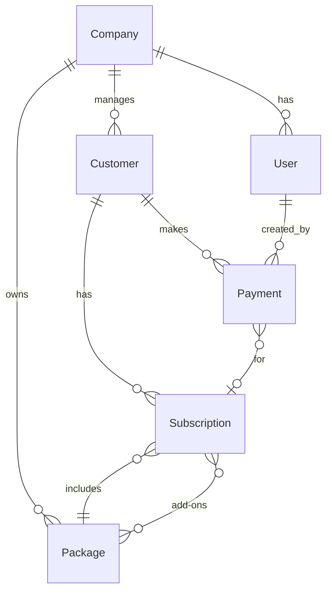

# Design Document

## Overview

The Recursive Billing Customer Management System is a full-stack application built with TypeScript, featuring a React frontend with ShadCN UI components and TailwindCSS, and a Node.js backend with MongoDB. The system manages companies, users, packages, customers, subscriptions, and payments in a hierarchical structure.

## Architecture

### Frontend Architecture
- **Framework**: React with TypeScript
- **Styling**: TailwindCSS with ShadCN UI components
- **State Management**: React hooks and context (for global state if needed)
- **Routing**: React Router for navigation
- **HTTP Client**: Axios or Fetch API for backend communication

### Backend Architecture
- **Framework**: Node.js with Express and TypeScript
- **Database**: MongoDB with Mongoose ODM
- **Authentication**: JWT-based authentication
- **Validation**: Zod schemas for request validation
- **Testing**: Vitest for unit and integration tests

### Database Schema Extensions
Based on existing models, we need to add:
- **Subscription Model**: Links customers to packages with duration
- **Payment Model**: Tracks payments made by customers

## Components and Interfaces

### Common UI Components

#### Table Component
```typescript
interface TableProps<T> {
  data: T[];
  columns: ColumnDef<T>[];
  loading?: boolean;
  onRowClick?: (row: T) => void;
  actions?: (row: T) => React.ReactNode;
}
```

#### Pagination Component
```typescript
interface PaginationProps {
  currentPage: number;
  totalPages: number;
  pageSize: number;
  totalCount: number;
  onPageChange: (page: number) => void;
  onPageSizeChange: (size: number) => void;
}
```

#### Form Components
- **FormField**: Reusable form field with validation
- **FormSelect**: Dropdown with search functionality
- **FormDatePicker**: Date selection component
- **FormTextarea**: Multi-line text input

### Page Components

#### Customer Management Pages
1. **CustomerTable**: List view with pagination, search, and filters
2. **CustomerView**: Detailed customer information with subscriptions and payments
3. **CustomerEdit**: Form for editing customer information
4. **CustomerAdd**: Form for adding new customers

#### Package Management Pages
1. **PackageTable**: List view filtered by package type
2. **PackageForm**: Add/Edit package form

#### Company & User Management Pages
1. **CompanyTable**: Company listing and management
2. **UserTable**: User management within companies

### Backend Models to Add

#### Subscription Model
```typescript
interface SubscriptionInterface extends Document {
    customer_id: mongoose.Types.ObjectId;
    package_id: mongoose.Types.ObjectId;
    add_on_ids: mongoose.Types.ObjectId[];
    subscription_months: number;
    monthly_amount: number;
    total_amount: number;
    start_date: Date;
    end_date: Date;
    is_active: boolean;
    company_id: mongoose.Types.ObjectId;
    createdAt?: Date;
    updatedAt?: Date;
}
```

#### Payment Model
```typescript
interface PaymentInterface extends Document {
    customer_id: mongoose.Types.ObjectId;
    subscription_id?: mongoose.Types.ObjectId;
    amount: number;
    payment_date: Date;
    payment_method?: string;
    notes?: string;
    company_id: mongoose.Types.ObjectId;
    created_by: mongoose.Types.ObjectId;
    createdAt?: Date;
    updatedAt?: Date;
}
```

## Data Models

### Existing Models (Already Implemented)
- **Company**: name, address, phone_no, email, owner_name, is_active
- **User**: name, username, password, phone_no, user_type, company_id, is_active
- **Package**: name, package_type, price_per_month, company_id, is_deleted, deleted_at
- **Customer**: first_name, last_name, care_of, phone, address, box_no, note, latitude, longitude, old_due, company_id, is_active, is_deleted, deleted_at, deleted_by

### New Models to Implement
- **Subscription**: Links customers to packages with duration and pricing
- **Payment**: Tracks all payments made by customers

### Data Relationships


## Error Handling

### Frontend Error Handling
- **API Error Interceptor**: Centralized error handling for HTTP requests
- **Form Validation**: Real-time validation with error messages
- **Toast Notifications**: User-friendly error and success messages
- **Error Boundaries**: Catch and handle React component errors

### Backend Error Handling
- **Global Error Middleware**: Centralized error handling
- **Custom Error Classes**: Structured error responses
- **Validation Errors**: Detailed field-level validation messages
- **Database Error Handling**: Mongoose error transformation

### Error Response Format
```typescript
interface ErrorResponse {
  success: false;
  message: string;
  errors?: Record<string, string[]>;
  statusCode: number;
}
```

## Testing Strategy

### Frontend Testing
- **Component Testing**: Test individual components with React Testing Library
- **Integration Testing**: Test component interactions and data flow
- **E2E Testing**: Critical user flows with Playwright or Cypress

### Backend Testing
- **Unit Tests**: Test individual functions and services
- **Integration Tests**: Test API endpoints with test database
- **Model Tests**: Test Mongoose models and validations

### Test Coverage Goals
- **Backend**: Minimum 80% code coverage
- **Frontend**: Focus on critical components and user flows
- **API Tests**: All endpoints with success and error scenarios

## Security Considerations

### Authentication & Authorization
- **JWT Tokens**: Secure token-based authentication
- **Role-based Access**: Admin vs Employee permissions
- **Company Isolation**: Users can only access their company's data

### Data Protection
- **Input Validation**: All user inputs validated and sanitized
- **SQL Injection Prevention**: Mongoose ODM provides protection
- **XSS Prevention**: Proper data encoding in frontend
- **CORS Configuration**: Restrict cross-origin requests

## Performance Optimization

### Frontend Performance
- **Code Splitting**: Lazy load components and routes
- **Memoization**: React.memo for expensive components
- **Virtual Scrolling**: For large data tables
- **Image Optimization**: Lazy loading and compression

### Backend Performance
- **Database Indexing**: Proper indexes on frequently queried fields
- **Pagination**: Limit data transfer for large datasets
- **Caching**: Redis for frequently accessed data
- **Query Optimization**: Efficient MongoDB queries with population

## Deployment Architecture

### Development Environment
- **Frontend**: Vite dev server on port 5173
- **Backend**: Node.js server on port 3000
- **Database**: Local MongoDB instance

### Production Considerations
- **Frontend**: Static build deployed to CDN
- **Backend**: Node.js server with PM2 process manager
- **Database**: MongoDB Atlas or self-hosted MongoDB
- **Environment Variables**: Secure configuration management